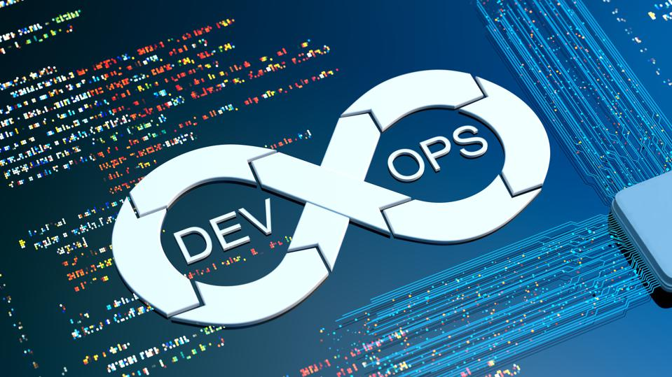

[](https://aws.amazon.com/)
[](https://www.terraform.io/) 
[](https://www.ansible.com/)
[](https://dev.azure.com/)
[](https://git-scm.com/)
[](https://www.sonarsource.com/products/sonarqube/)
[](https://prometheus.io/) 
[](https://grafana.com/)


# Treball Fi de Grau UOC - Metodologia Devops
## Repositori del projecte de fi de grau Metodologia Devops
 * Aquí trobaràs tot el necessari per reproduir l'entorn del treball

## AWS

 La infraestructura amb les eines de gestio de la metodologia DevOps es la seguent:
 * 1 Instancia amb Ansible i Terraform a partir de la AMI -> ubuntu/images/hvm-ssd/ubuntu-bionic-18.04-amd64-server-20221201. 
 * 1 Instancia amb Sonarqube a partir de la AMI -> bitnami-sonarqube-9.3.0-15-r01-linux-debian-10-x86_64-hvm-ebs-nami. 
 * 1 Instancia amb Prometheus a partir de la AMI -> ubuntu/images/hvm-ssd/ubuntu-bionic-18.04-amd64-server-20221201. 
 * 1 Instancia amb Grafana a partir de la AMI -> ubuntu/images/hvm-ssd/ubuntu-jammy-22.04-amd64-server-20221201. 

## IPs de Xarxa per Maquina
* Ansible-Terraform  172.31.41.229. 
* Sonarqube          172.31.42.145. 
* Prometheus         172.31.46.105. 
* Grafana            172.31.36.121. 

## Configuració d'una AMI personalitzada per després desplegar-les amb Terraform
Per la configuració dels servidors Web.    
Primer s'ha de creaar una instancia manualment a partir de la AMI ->
Instal·la el següent:

* Executa aquest script per configurar els protocolos WinRM dins del servidor. (Aixó garanteix que ansible pughi connectar a la maquina).
* Excuta aquest script per crear l'usuari Ansible dins del servidor. Et demanará una password. Recorda que després la has de configurar en aquest fitxer de configuració d'Ansible. 
Un cop tot instal·lat crea una AMI a partir de la Instancia. El nom que et generi aquesta nova AMI l'has de configurar en aquest fitxer de terraform.

Posteriorment ja es pot eliminar la instacia per posteriorment crear les instancies quan es necessitin en amb Terraform.  

## Sonarqube
Sonarqube ja ve configurat en la AMI utilitzada.
* Configura una IP elastica a AWS que apunti aquesta instancia d'aquesta manera quan s¡integri a Azure Devops no perdràs la comunicació amb el servidor en cas de que reiinici.
* Ja pots entrar a Sonarqube a partir de http://ip-publica-servidor-aws-sonarqube

## Azure Devops

Has de crear un usuari aqui: https://dev.azure.com
* Crear un nou projecte

* A Azure Devops hi ha el repositori tfgUoc.git. El codi font es pot trobar aquí:  [`CODI FONT`](./codi-prova)
* Per clonar el codi a dins de Azure Devops Repos [](https://dev.azure.com/) pots clonar amb aquest enllaç https://github.com/keys4dev/tfgUoc.git
* Per clonar al teu ordinador local necessites instal·lar git [](https://git-scm.com/) , , després el pots clonar amb la comanda:
```bash
git clone https://github.com/keys4dev/tfgUoc.git
```
* Pots importar la pipeline de compilació d'aquest fitxer.  
* Per afegir els servidors web com a targets un cop els tinguis desplegats amb Terraform has d'anar a Pipelines->Deployment Groups -> Crear un nou deployment group -> Afegir un nou target -> Copiar el script que apareix i executarlo al servidor web.
Mes informació aqui: https://learn.microsoft.com/en-us/azure/devops/pipelines/release/deployment-groups/?view=azure-devops. 

* Importar la pipeline de compilació d'aquest fitxer dins de Azure Pipelines.  

* Eecutala per tal de prova si el codi es compila.  

* Finalment per desplegar el codi has d'anar a Pipelines -> Releases -> i sobre el botó new pots importar aquest fitxer josn.  

* Es posible que s'hagi de configurar algún parametre per que funcioni.  

## Terraform
Dins de la instancia ansible-terraform instal·la Terraform amb aquestes comandes:

```bash
sudo apt-add-repository "deb [arch=$(dpkg --print-architecture)] https://apt.releases.hashicorp.com $(lsb_release -cs) main"
sudo apt update && sudo apt install terraform
```

Copia la carpeta terraform dins del servidor ansible-terraform.

```bash
cd terraform
terraform init
terraform commit
terraform plan
terraform apply
```

## Ansible
Dins de la instancia ansible-terraform instal·la ansible amb aquestes comandes:

```bash
sudo apt-add-repository ppa:ansible/ansible
sudo apt update
sudo apt install ansible
```

Copia la carpeta ansible dins del servidor Ansible
```bash
cd ansible
ansible-playbook setup_servers.yml
sudo nano Install_Hosting_Bundle.yml
```


## Grafana
Instal·la grafana amb aquestes comandes:
```bash
sudo apt update
sudo apt -y install grafana
sudo systemctl enable --now grafana-server
```

## Prometheus
```bash
wget https://s3-eu-west-1.amazonaws.com/deb.robustperception.io/41EFC99D.gpg | sudo apt-key add -
sudo apt-get update -y
sudo apt-get install prometheus prometheus-node-exporter prometheus-pushgateway prometheus-alertmanager-y
sudo systemctl start prometheus
sudo systemctl enable prometheus
```
* Ara ja pots accedir a prometheus per la url: http://ip-publica-servidor-aws-prometheus:9090 i afegir els servidors web desplegats.


